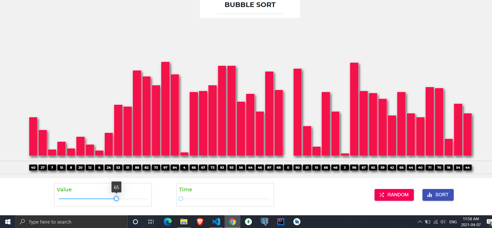
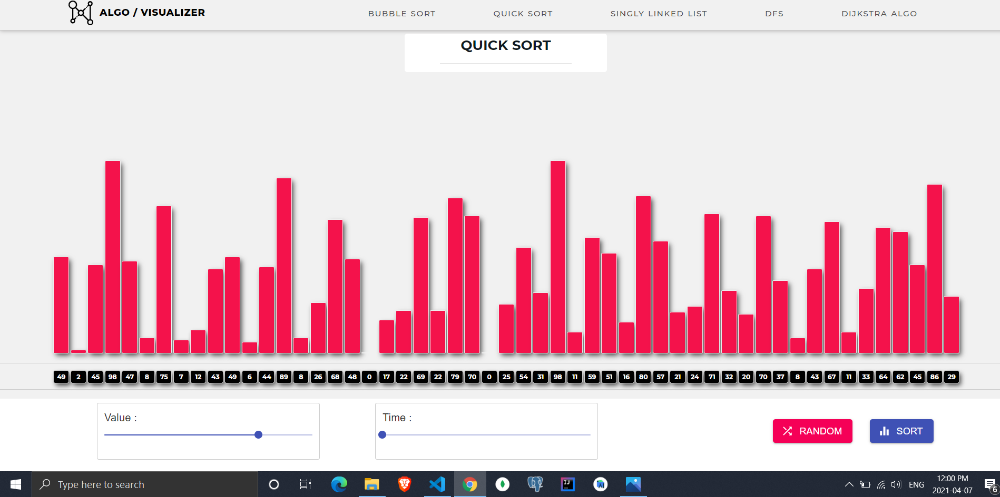
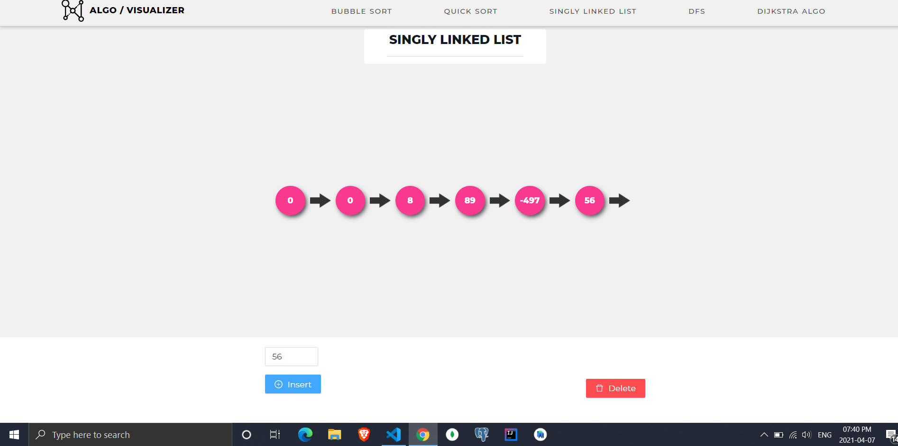
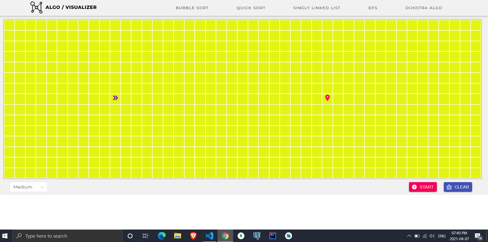

<h1 align="center">  ALGO / VISUALIZER </h1>
Algorithm visualizer is a react base web app where we can visualize and play with algorithm.

## Algorithms

- Bubble Sort
- Quick Sort
- Singly Linked List
- DFS
- Dijkstra

## Prerequisite

- Basic coding knowledge

- Some concept about data structure and algorithm

- Mathematices

## Project Initialization

- Clone the project

- Change directory to AlgoVisualizer

        cd AlgoVisualizer

- Open terminal and write

        npm i
       // or
        yarn add

- To run the code

        npm start
       // or
        yarn start

### Technologies

 

## Highlights

## Words about this project

<h2 style="color: #323dfa; font-weight:500"> Bubble Sort </h2>

  Bubble Sort is simple sorting algorithm. It is slow sorting alogithm .It used loop for sorting. This algorithm used loop so Time Complexity is high.

**And Degree of Polynomial :- 2**

**Time Complexity is O(n^2) .**

Time Complexity is n^2 because here i used Two itarations .

  

<h2 style="color: #323dfa; font-weight:500"> Quick Sort </h2>

  Quick Sort is divide and conquer algorithms. Basically It has a pivot index . Using the pivot index it apply recursion . As, It is use recursion so it's time complexity will reduce

**Time Complexity is O(n log n)**

  

<h2 style="color: #323dfa; font-weight:500"> Singly Linked List </h2>

   Singly Linked List is a type of Data structure . Where it can used in store Data . In this List where every element has a Head and Tail . And every element pointing to tail . And it is a <strong> One Dircetional </strong> like <strong> Vector in Mathematices</strong>.
   We can add or remove element from the front, the end or from anywhere in the list. <strong style="color:red "> But in This project we can remove or add from last in list</strong>

  

<h2 style="color: #323dfa;font-weight:500;"> DFS </h2>

   DFS is searching technique in a Graph . DFS means Depth first search. In this technique search will happen in depth of tree if seaching node is found then search is complete but id searching node is not found . it will backtrack .

  

<h2 style="color: #323dfa; font-weight:500"> Dijkstra </h2>

 Dijkstra is very popular algorithms. It found the sortest path between two nodes . It works in weight grarph. To find the sortest path we can use adjecency matrix or adjecency list . Here i use adjecency List .

  

<h3> Note : </h3>
<ul>
<li style="color: #fb005f; font-weight:500"> <strong> It is not mobile responsive </strong></li>
<li style="color: #fb005f; font-weight:500"><strong> Please use Chrome browser (Recomanded)</strong> </li>
<li style="color: #fb005f; font-weight:500"><strong> If you have low end PC .Then before opening this web app close all tab (Recomanded) </strong></li>
</ul>

### PROJECT URL

Deployment Server :-  netlify 

<a href="https://algo-visualizer-wasim.netlify.app">Click me to See </a>

### DEVELOPER

<table>
<tbody>
<tr>
<td align='center'>
        
<a href="https://github.com/wasim15185"> <Strong>Wasim Akram Biswas </Strong></a>
</td>
</tr>
</tbody>
</table>

## MIT License

        Copyright (c) 2021 Wasim Akram Biswas

        Permission is hereby granted, free of charge, to any person obtaining a copy
        of this software and associated documentation files (the "Software"), to deal
        in the Software without restriction, including without limitation the rights
        to use, copy, modify, merge, publish, distribute, sublicense, and/or sell
        copies of the Software, and to permit persons to whom the Software is
        furnished to do so, subject to the following conditions:

        The above copyright notice and this permission notice shall be included in all
        copies or substantial portions of the Software.

        THE SOFTWARE IS PROVIDED "AS IS", WITHOUT WARRANTY OF ANY KIND, EXPRESS OR
        IMPLIED, INCLUDING BUT NOT LIMITED TO THE WARRANTIES OF MERCHANTABILITY,
        FITNESS FOR A PARTICULAR PURPOSE AND NONINFRINGEMENT. IN NO EVENT SHALL THE
        AUTHORS OR COPYRIGHT HOLDERS BE LIABLE FOR ANY CLAIM, DAMAGES OR OTHER
        LIABILITY, WHETHER IN AN ACTION OF CONTRACT, TORT OR OTHERWISE, ARISING FROM,
        OUT OF OR IN CONNECTION WITH THE SOFTWARE OR THE USE OR OTHER DEALINGS IN THE
        SOFTWARE.
